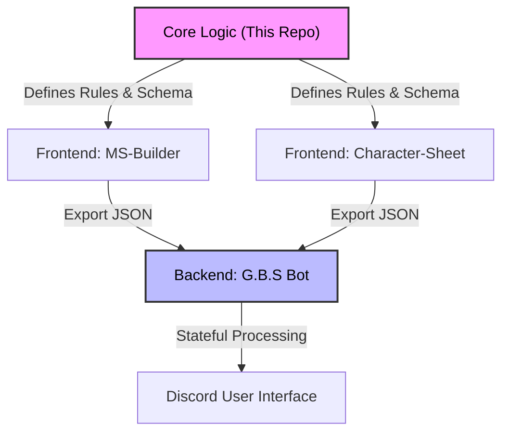
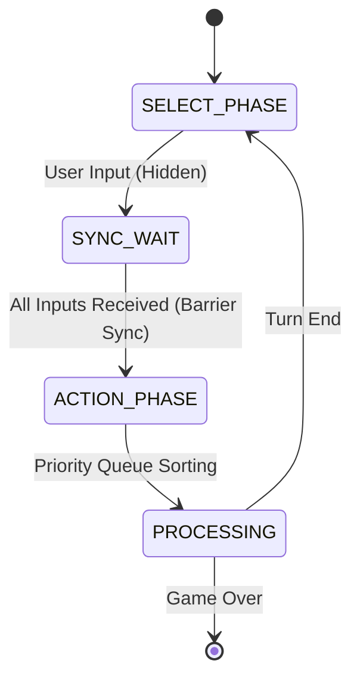

# GUNDAM-TRPG Ecosystem (Integrated Operation System)
---

> **Note**
> 本リポジトリは、単なるTRPGルールブック（創作物）ではなく、WebアプリケーションとDiscord Botを連携させた「統合運用システム」の仕様定義書（Core Logic / Single Source of Truth）です。
>
> This repository serves as the **Single Source of Truth** for the entire ecosystem, defining the domain logic, data schemas, and state machine architecture used across the frontend (Web) and backend (Bot).

## 1. System Architecture

本プロジェクトは、以下の4つのコンポーネントが疎結合に連携する分散型システムとして構築されています。

| Component | Tech Stack | Role |
| :--- | :--- | :--- |
| **Core Logic** (This Repo) | Markdown | **Single Source of Truth (SSOT)**. ドメインロジック、計算式、データ構造の定義。 |
| **[MS-Builder](https://github.com/MaryCache/ms-builder)** | Vue.js, TS | **Dependency Resolution**. パーツ間の複雑な依存関係・トレードオフを解決する機体構築ツール。 |
| **[Character-Sheet](https://github.com/MaryCache/my-character-sheet)** | Vue.js, TS | **Input Interface**. バリデーションを備えたキャラクターデータ作成ツール。 |
| **[G.B.S Bot](https://github.com/MaryCache/gbs-gundam-battlesystem-bot)** | Node.js, Discord.js | **Execution Engine**. JSONデータを読み込み、ゲーム進行と計算処理を自動化する実行環境。 |

---

## 2. Core Design Philosophy (Engineering Approach)

アナログゲーム（TRPG）が抱える構造的な限界を、「デジタルゲーム理論の輸入」と「ドメインモデリングの再構築」によって解決しました。

### 2.1. Game Theory: "Variable Luck" vs "Invariant Luck"
**【課題：計算コストの壁と戦略性の欠如】**
従来のアナログTRPGは、ダイスによる「不変の運（純粋な確率論）」に依存しており、計算の煩雑さから高度な駆け引き（読み合い）の実装が困難でした。

**【解決策：Botへの計算オフロードによるゲーム理論の導入】**
人間には不可能な計算処理をBotに肩代わりさせることで、「可変の運（リスク・リターン管理）」をシステムに実装しました。
「リスク0の最善手」を構造的に排除し、ナッシュ均衡的な駆け引きを生み出すことで、ロールプレイの自由度と戦略的ゲーム性を両立させています。

### 2.2. Probability Design: Binary to Gradient
**【課題：二値判定によるリアリティの欠如】**
成功(1)/失敗(0)の二値判定では、「専門家（技能値80）の失敗」と「素人（技能値10）の失敗」が同義となり、キャラクターのアイデンティティ（UX）を損なっていました。

**【解決策：現象レベル（Output Quality）の採用】**
乱数を「成否」ではなく「結果の振れ幅（Variance）」として扱うアルゴリズムを策定。
$$Output = BaseSkill + RandomModifier$$
これにより、「専門家の失敗は、素人の成功よりも品質が高い」という統計的なリアリティを担保しつつ、クリティカル/ファンブルという特異点（Edge case）を残すことでエンターテインメント性を維持しています。

### 2.3. Domain Modeling: Refactoring "Power & Speed"
**【課題：レガシーパラメータの矛盾】**
従来のRPGでは「威力」と「速度」が独立していますが、物理法則（$F=ma$）や実戦において、これらは不可分です。

**【解決策：概念の抽象化と統合】**
物理法則に基づき、パラメータを以下の対立軸へリファクタリングしました。
*   **精度 (Precision):** 速度・正確さ・軌道を包括した「対処の難易度」。
*   **回避 (Evasion):** 機動力・反応速度・状況判断を含めた「対応許容量」。

ダメージを乱数加算ではなく、「精度の高さが対応力をどれだけ上回ったか（Differential Margin）」で算出することで、計算フローを一本化し、納得感のあるロジックを構築しました。

---

## 3. Technical Implementation

### 3.1. State Machine Architecture (Battle System)
戦闘処理において、以下のステートマシン（状態遷移）を定義し、「非同期入力の同期化」を実現しています。

1.  **SELECT PHASE (Async):** 全プレイヤーが非同期に行動を予約（Commit）。
2.  **SYNC (Barrier):** 全員の入力完了をトリガーとして情報を一斉開示（Reveal）。
3.  **ACTION PHASE (Priority Queue):** 行動値や優先度フラグに基づき、Botが処理順をソートして実行。

### 3.2. Dependency Resolution (MS-Builder)
Webアプリケーション側では、機体構築における複雑な依存関係解決（Constraint Satisfaction Problem）を実装しています。

*   **Resource Management:** エンジン出力（Supply）≧ 武装消費電力（Demand）の常時監視。
*   **Trade-off Logic:** 装甲（Armor）を追加すると、重量（Weight）が増加し、機動性（Mobility）と回避指数（Evasion）が低下するリアクティブな計算。

---

## 4. Development Process

**「AIを実装パートナーとした、設計主導型開発」**

*   **Role:**
    *   **Human (Me):** PM / Architect / Tech Lead. 要件定義、ロジック設計、品質保証を担当。
    *   **AI (Copilot/ChatGPT):** Coder / Reviewer. 実装、単体テスト作成、シンタックスチェックを担当。
*   **Methodology:**
    *   AIに推測の余地を与えないレベルまで、自然言語による**厳密な仕様定義（Logic Design）**を作成。
    *   Markdownによる仕様書をSSOTとし、実装（Web/Bot）との乖離を防ぐ運用フローを確立。
