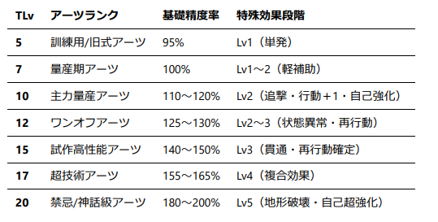

## MS作成規律
### ─=≡STATUS≡=─
```
Type：F・S・Eから選択。Fは近距離戦を得意とし、Sは遠距離戦を得意とする。Eは扱いやすく、継戦能力が高い。

Type：Fの恩恵効果：BURST【F】を獲得。BATTLE PHASE中、搭乗者の操縦技能【近接剣術】のLvを+1する。
BURST【F】：戦闘中一度だけ使用できる。【近接剣術】の判定値を-30する。

Type：Sの恩恵効果：BURST：Sを獲得。
ACTION PHASE中、搭乗者の操縦技能【精密射撃】のLvを+1する。
BURST【S】：戦闘中一度だけ使用できる。【精密射撃】の判定値を-30する。

Type：Eの恩恵効果：BURST【E】を獲得。搭乗者の操縦技能【機動制御】のLvを+1する。
BURST【E】：戦闘中一度だけ使用できる。【機動制御】の判定値を-30する。

TLv：この機体が製造された際に使われた技術レベル、通称テクレベルを表す。
テクレベルは機体を入手するシナリオに依存し、GMが決定する。
従軍者は自身の機体のステータスにおいて、(機動)+(積載)=(TLvの値)となるように配分しなければならない。

機動：機体の機動力を表すステータス。この値によって行動順が決まる。防御計算時にも回避行動として使用できる。

装甲：機体の装甲の厚さを表すステータス。防御計算時やCORE：ARTS『SHIFT：SAFE』使用時に消費される。

積載：積載している物品の総重量を表すステータス。(装備WEAPON総重量)+(装甲)=(積載)である。
```
### ─=≡WEAPON≡=─
```
『WEAPONの名前』
重量：このWEAPONの重量。基準値は1であり、TLvを参照して特別多機能であったり、鈍重であったりする場合に増加する。

使用部位：このWEAPONを取り扱う時に使用する機体の部位。使用部位を破壊されているとき、このWEAPONに依存するARTSは使用できない。

故障：ARTS使用時の技能判定時、その判定値が故障の数値以上であれば、このWEAPONは故障する。故障したWEAPONに依存するARTSは使用できない。

装填：一回の戦闘における、ARTSの使用回数上限。
─=≡詳細≡=─
フレーバーテキスト。
```
### ─=≡ARTS≡=─
```
『ARTSの名前』
ARTS.No.：ARTSにつけられる番号。ARTS予約時に参照する。1〜4はCORE：ARTSによって使用される。CUSTOM：ARTSのARTS.No.は、5から先の整数をPLの任意で設定してよい。
　
依存武器：このARTSを使用する時に取り扱うWEAPON。『WEAPON名』TLv.x(x＝対象WEAPONのTLv)と記述する。依存武器が故障しているとき、このARTSは使用できない。
　
依存技能：このARTSを使用するときに使用する従軍者の技能。
　
有効射程：この数値を超える座標差量を持つ機体には、このARTSは使用できない。
　
基礎精度率：最終的な命中判定に使用される精度指数を算出するための基準値。このARTSの精度指数は、依存技能行使Lvにこの値を乗算して導き出される。単位は%表記。
─=≡効果≡=─
特殊な効果があればここに記載する。
─=≡詳細≡=─
フレーバーテキスト。
```

[A.R.S　機体設計申請フォーム](https://ms-builder.vercel.app/)


## 🧩 機体性能基準（Tlv.5〜20）
```
各機体はTLvを基準に、(機動) + (積載) = TLv として性能が配分される。
（積載） = （WEAPON総重量） + （装甲値）である。
機体の自由度はTLvによって決まる。
シナリオによって従軍者に与えられる機体のTLv.は異なるが、m=5 M=20　とする。
通常、シナリオにおける所属文明の基準TLvは10とする。
また、以下の表はあくまでも想定される水準にすぎない。
```

## ⚙️ WEAPON性能基準（Tlv.5〜20）
```
WEAPONのTLvは、原則機体と同じ値になる。
ただし、シナリオ上の特殊な理由によって取得したWEAPONであれば、この限りでない。
TLv ≒ ((故障値) - 90) + (装填数 × 0.5)を基準として調整を行う。
装填数のないWEAPONの場合、故障値は「TLv.10のとき80」を基準にする。  
「故障値」は信頼性の高さを、「装填数」は継戦能力の高さを示している。
```

## ⚡ アーツ性能基準（Tlv.5〜20）
```
アーツの強さは「兵器の技術力（TLv）」と「従軍者の技能Lv」に依存する。
アーツのTLvはWEAPONのものと同一として扱う。 
主に基礎精度率（%補正）と特殊効果段階によって機体格差を設ける。
```


## CORE：ARTS
```
CORE：ARTSとは、すべてのモビルスーツ（MS）に標準装備されている基本アーツ群である。  
戦闘を行うすべての機体は、例外なくこのCORE：ARTSを4種保持している。
CORE：ARTSには以下の4種が存在する。

・『OVER：DOSE』　　─ バフ
・『SYNK：BLOCK』　 ─ デバフ
・『SHIFT：SAFE』　 ─ 防御
・『MODE：ULT』　　 ─ 一度きりの切札  

これらのCORE：ARTSは、各種機体の解釈に合わせて名称を自由に変更してもよい。  
ただし、名称を変更しても効果・処理内容は同一であるものとする。
```

### ─=≡ARTSの上限≡=─
```
従軍者が装備・設計できるARTSの総数には上限が存在する。
この上限は、搭乗機体の技術レベル（TLv.）に等しいものとする。

ARTS上限数 = 機体のTLv.
```